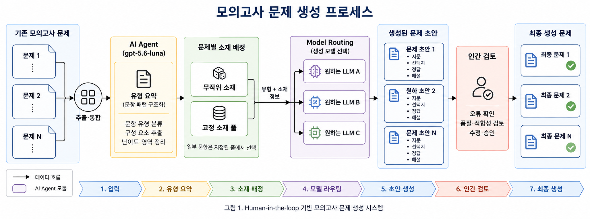
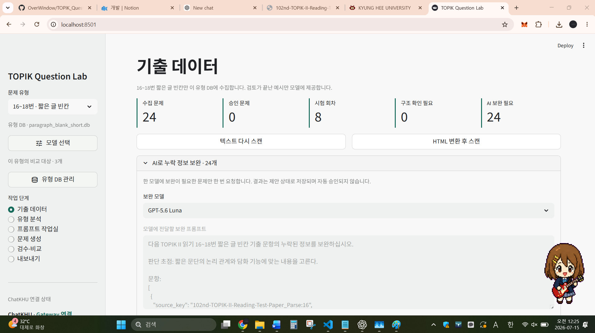

# TOPIK Question Lab

TOPIK II 읽기 기출을 유형별로 수집·검토하고, 여러 ChatKHU 모델로 유형 분석과 새 문항 생성을 비교하는 로컬 Streamlit 앱입니다. 별도 파인튜닝 대신 승인된 기출 예시와 편집 가능한 유형 분석서를 매 요청에 제공하는 few-shot 방식으로 작동합니다.

## 시스템 아키텍처



**그림 1. 유형별 TOPIK 문제 분석 및 다중 LLM 생성 파이프라인.** 동일 유형의 승인된 기출 문제를 결합해 공통 유형 분석과 특징 표현을 구성하고, 편집 가능한 JSON 출력 프롬프트와 함께 선택한 ChatKHU 모델로 전달합니다. 각 모델의 생성 결과는 유형별 DB에 독립적인 실행 기록으로 저장되어 형식 검사와 사람 평가 단계에서 비교됩니다. 그림의 세 모델은 기본 비교 모델이며, 실제 앱에서는 모델 선택 모달을 통해 다른 ChatKHU 모델도 추가할 수 있습니다.

## 실행 화면



**그림 2. TOPIK Question Lab 기출 데이터 검토 화면.** 왼쪽 사이드바에서 문제 유형, 비교 모델과 작업 단계를 선택하고, 본문에서 수집 현황을 확인하거나 누락된 정답·출제 포인트·설명을 보완할 수 있습니다. 유형 분석, 프롬프트 편집, 문제 생성, 검수·비교와 내보내기도 같은 화면의 단계 메뉴에서 이동합니다.

## 주요 기능

- `1~50번`을 18개 출제 유형으로 분리해 수집합니다. 저작권 사유로 지문이 공개되지 않은 문항만 자동으로 제외합니다.
- 기출, 프롬프트, 모델 실행 원문, 생성 결과와 사람 평가를 유형별 SQLite DB에 저장합니다.
- 3~4번 문제에서 누락된 밑줄 위치를 `[[밑줄 부분]]` 또는 별도 입력란으로 직접 지정할 수 있습니다.
- ChatKHU 전체 허용 모델을 동기화하고 유형마다 비교할 모델을 선택할 수 있습니다.
- 기본 비교 모델은 GPT-5.6 Luna, Claude Haiku 4.5, Gemini 3.5 Flash입니다.
- 기출 저장과 생성 문제 평가가 끝나면 자동으로 다음 문제로 이동합니다.
- 승인된 생성 문제를 TXT, JSON, CSV로 내보냅니다.
- 원본 문제와 선택한 모델 A·B의 생성 문제를 나란히 배치한 3열 비교 PDF를 만듭니다.

## 요구 사항

- Python 3.11
- 인터넷 브라우저
- ChatKHU 웹 사용이 가능한 계정
- 선택 사항: ChatKHU Gateway API 키 또는 DeepSeek 공식 API 키

Python 패키지는 모두 프로젝트의 `.venv`에만 설치됩니다.

## Windows 실행

프로젝트 루트에서 PowerShell을 열고 다음 명령을 실행합니다.

```powershell
Set-ExecutionPolicy -Scope Process Bypass
.\setup_topik_lab.ps1
.\run_topik_lab.ps1
```

설치가 끝난 뒤에는 다음 명령만 실행하면 됩니다.

```powershell
.\run_topik_lab.ps1
```

## macOS 실행

### 1. Python 확인

터미널에서 Python 3.11이 설치되어 있는지 확인합니다.

```bash
python3.11 --version
```

명령을 찾을 수 없다면 Homebrew를 사용하는 경우 다음과 같이 설치할 수 있습니다.

```bash
brew install python@3.11
```

### 2. 프로젝트 설치

터미널에서 프로젝트 폴더로 이동한 뒤 설치 스크립트를 실행합니다.

```bash
cd /path/to/Unigate
sh setup_topik_lab.sh
```

### 3. 앱 실행

```bash
sh run_topik_lab.sh
```

설치 스크립트를 사용하지 않고 직접 실행하려면 다음 명령을 사용합니다.

```bash
python3.11 -m venv .venv
./.venv/bin/python -m pip install --upgrade pip
./.venv/bin/python -m pip install -r requirements.txt
./.venv/bin/python -m streamlit run topik_question_lab/app.py
```

Apple Silicon과 Intel Mac 모두 같은 명령을 사용합니다. 앱 실행 후 브라우저에서 [http://localhost:8501](http://localhost:8501)을 엽니다. 종료할 때는 앱을 실행한 터미널에서 `Control+C`를 누릅니다.

## ChatKHU 사용

### 웹 수동 모드

API 키 없이 사용할 수 있는 기본 방식입니다.

1. 앱에서 모델과 문제 유형에 맞게 완성된 프롬프트를 확인합니다.
2. [ChatKHU](https://chat.khu.ac.kr)에서 같은 모델을 선택해 프롬프트를 실행합니다.
3. 모델의 JSON 응답을 앱의 응답 입력란에 붙여넣습니다.
4. 검증 후 분석 또는 생성 결과로 저장합니다.

### Gateway 자동 호출

조직에서 Gateway 키 발급을 허용한 경우 `.env.example`을 `.env`로 복사하고 키를 입력합니다.

macOS:

```bash
cp .env.example .env
```

Windows PowerShell:

```powershell
Copy-Item .env.example .env
```

`.env`:

```dotenv
CHATKHU_API_KEY=발급받은_키
CHATKHU_BASE_URL=https://factchat-cloud.mindlogic.ai/v1/gateway
CHATKHU_WEB_URL=https://chat.khu.ac.kr
```

키는 UI나 DB에 저장되지 않습니다. Gateway 크레딧은 사용자가 분석 또는 생성 실행 버튼을 눌렀을 때만 사용됩니다. 사용 가능한 모델과 크레딧 정책은 계정과 조직 설정에 따라 달라질 수 있습니다.

사이드바의 `모델 선택`을 누르면 다음 기능을 사용할 수 있습니다.

- ChatKHU 전체 허용 모델 동기화
- 모델 이름 또는 ID 검색
- 복수 선택, 전체 선택과 선택 해제
- 목록에 없는 모델 ID 직접 추가

모델 선택은 유형 DB별로 저장됩니다. 이미 사용자가 저장한 선택은 기본 모델 목록이 변경되어도 유지됩니다.

### DeepSeek 공식 API

DeepSeek은 ChatKHU에 포함되지 않으므로 공식 API에 직접 연결합니다. 앱의 모델 선택 모달에서 `DeepSeek V4 Flash` 또는 `DeepSeek V4 Pro`를 선택할 수 있으며, 자동 호출에는 ChatKHU 키와 별도로 `DEEPSEEK_API_KEY`가 필요합니다.

1. [DeepSeek Platform API Keys](https://platform.deepseek.com/api_keys)에 로그인합니다.
2. 새 API 키를 발급하고 필요한 경우 플랫폼에서 API 잔액을 충전합니다.
3. 프로젝트 루트의 `.env`에 다음 값을 추가합니다.

```dotenv
DEEPSEEK_API_KEY=발급받은_키
DEEPSEEK_BASE_URL=https://api.deepseek.com
DEEPSEEK_WEB_URL=https://chat.deepseek.com
```

4. 앱을 재시작하고 사이드바의 `모델 선택`에서 `DeepSeek V4 Flash` 또는 `DeepSeek V4 Pro`를 추가합니다.
5. `유형 분석` 또는 `문제 생성`에서 DeepSeek을 선택해 실행합니다.

모델 ID는 각각 `deepseek-v4-flash`, `deepseek-v4-pro`입니다. 두 모델을 동시에 선택해 같은 프롬프트로 비교할 수도 있습니다. 기존 `deepseek-chat`과 `deepseek-reasoner` 별칭은 공식 문서상 2026-07-24 종료 예정이므로 사용하지 않습니다.

DeepSeek 공식 API는 유료이며 ChatKHU 크레딧과 별도로 과금됩니다. 키는 `.env`에서만 읽고 UI나 DB에는 저장하지 않습니다. 앱은 사용자가 API 실행 버튼을 눌렀을 때만 요청합니다.

## 작업 흐름

1. 사이드바에서 실험할 문제 유형을 선택합니다.
2. `기출 데이터`에서 해당 유형의 원문, 지문과 보기 4개를 검토합니다.
3. 정답, 출제 포인트와 설명이 비어 있으면 `AI로 누락 정보 보완`을 실행하거나 직접 입력합니다.
4. 검토가 끝난 문제만 `학습 예시로 승인`합니다.
5. `유형 분석`에서 모델별 분석을 비교하고 공통 유형 분석서를 편집합니다.
6. `프롬프트 작업실`에서 생성 수, 난이도, 공통/모델별 지침과 최종 프롬프트를 확인합니다.
7. `문제 생성`에서 ChatKHU 웹 응답을 붙여넣거나 Gateway 모델을 선택해 실행합니다.
8. `검수·비교`에서 생성 문제를 수정하고 점수와 승인 여부를 저장합니다.
9. `내보내기`에서 승인 문제를 TXT, JSON 또는 CSV로 저장합니다.
10. 두 모델의 결과를 직접 비교하려면 `원본 · 모델 A · 모델 B 비교 PDF`에서 실제 사용 모델 두 개와 포함 범위를 선택해 PDF를 받습니다.

`기출 데이터`의 `저장하고 다음 문제`와 `검수·비교`의 `평가 저장하고 다음 문제`는 저장 성공 후 다음 항목으로 이동합니다. 마지막 문제에서는 현재 위치를 유지합니다.

`AI로 누락 정보 보완`에서는 보완 대상 문제를 회차·번호·질문 문구별로 선택할 수 있습니다. 선택한 문항만 API 및 복사 가능한 프롬프트에 포함되며, 응답에 선택하지 않은 문항이 들어 있어도 해당 문항에는 적용하지 않습니다.

## 원문 추가

### 추출된 텍스트 추가

`extracted_text`에 `*_questions.txt` 파일을 추가한 뒤 앱에서 `기출 데이터 > 텍스트 다시 스캔`을 누릅니다. 보기 번호 순서가 섞여 있어도 번호를 기준으로 정규화합니다.

### HTML 추가

새 HTML 파일을 `html변환` 폴더에 넣은 뒤 `기출 데이터 > HTML 변환 후 스캔`을 누릅니다.

원문 파일은 앱에서 수정하거나 삭제하지 않습니다.

## 지원 문제 유형

| 문제 번호 | 유형 |
|---|---|
| 1~2 | 문법 빈칸 |
| 3~4 | 유사 표현 |
| 5~8 | 짧은 글 소재 |
| 9~12 | 안내문·도표 내용 일치 |
| 13~15 | 문장 순서 |
| 16~18 | 짧은 글 빈칸 |
| 19~20 | 공통 지문: 빈칸·주제 |
| 21~22 | 공통 지문: 표현·내용 |
| 23~24 | 서사 지문: 심정·내용 |
| 25~27 | 신문 제목 해석 |
| 28~31 | 긴 글 빈칸 |
| 32~34 | 긴 글 내용 일치 |
| 35~38 | 글의 주제 |
| 39~41 | 문장 삽입 |
| 42~43 | 문학 지문: 심정·내용 |
| 44~45 | 논설 지문: 빈칸·주제 |
| 46~47 | 논설 지문: 태도·내용 |
| 48~50 | 고급 지문: 목적·빈칸·내용 |

공통 지문 문제는 세트 ID로 묶입니다. 한 문제의 공통 지문을 수정하면 같은 기출 세트 또는 모델 실행 세트의 지문도 함께 갱신됩니다.

44~45번은 회차에 따라 출제 순서가 다릅니다. 47~64회는 `44번 주제 · 45번 빈칸`, 83회 이후는 `44번 빈칸 · 45번 주제`이며, 앱은 질문 문구로 역할을 판별해 실제 번호와 순서를 보존합니다. 새 문제는 현행 순서로 생성합니다.

23번과 42번처럼 밑줄 위치가 텍스트 추출 결과에 남지 않는 문항은 기출 검토 화면의 지문에서 대상 부분을 `[[이렇게]]` 감싸거나 `밑줄 대상 표현` 입력란에 직접 입력해 지정할 수 있습니다. 밑줄이 지정되지 않은 문항은 AI 보완 대상에서 제외되어 먼저 수동 확인할 수 있습니다.

PDF/HTML 변환 과정에서 보기나 도표 구조가 사라진 문제는 버리지 않고 `구조 확인 필요` 상태로 가져옵니다. 문장 삽입 유형은 `주어진 문장`과 `(①)~(④)` 위치를 별도 필드로 관리합니다.

## 데이터 저장

유형별 DB는 다음 위치에 저장됩니다.

```text
data/types/<question_type>.db
```

각 DB에는 다음 데이터가 들어 있습니다.

- 정규화된 기출과 승인 상태
- 유형 분석서와 프롬프트 버전
- 모델 ID, 실제 요청 프롬프트와 원본 응답
- 토큰 사용량, 실행 시간과 오류
- 생성 문제, 자동 검사와 사람 평가

사이드바의 `유형 DB 관리`에서 DB를 삭제할 수 있습니다. 유형 ID 재입력과 확인 체크를 모두 통과해야 삭제가 실행됩니다. `extracted_text` 원문은 유지되며, 삭제한 유형을 다시 열면 새 DB를 만들고 원문을 다시 수집합니다.

## 프롬프트 모드

- `공통 프롬프트`: 모든 모델에 같은 지시문을 전달해 성능을 같은 조건에서 비교합니다.
- `모델별 최적화`: 공통 규칙에 모델별 짧은 실행 지침을 추가합니다.

모델별 지침은 `프롬프트 작업실`에서 편집할 수 있습니다. 실제 실행에 사용된 전체 프롬프트는 실행 기록에 보존됩니다.

## 테스트

Windows PowerShell:

```powershell
.\.venv\Scripts\python.exe -m pytest -q
```

macOS:

```bash
./.venv/bin/python -m pytest -q
```

## 문제 해결

### `python3.11: command not found`

Python 3.11을 설치한 뒤 터미널을 다시 열고 `python3.11 --version`을 확인합니다.

### `Address already in use` 또는 포트 충돌

다른 포트로 실행합니다.

```bash
./.venv/bin/python -m streamlit run topik_question_lab/app.py --server.port 8502
```

### macOS에서 스크립트 실행 권한 오류

README의 `sh setup_topik_lab.sh`, `sh run_topik_lab.sh` 형식으로 실행하면 실행 권한을 별도로 설정할 필요가 없습니다. 직접 실행하려면 다음 명령을 한 번 수행합니다.

```bash
chmod +x setup_topik_lab.sh run_topik_lab.sh
```

### ChatKHU 모델 자동 호출 실패

1. `.env`의 `CHATKHU_API_KEY`를 확인합니다.
2. 앱의 `모델 선택 > ChatKHU 전체 모델 동기화`를 실행합니다.
3. 계정의 허용 모델 목록에 해당 모델 ID가 있는지 확인합니다.
4. 자동 호출이 계속 실패하면 웹 수동 모드로 실행하고 JSON 응답을 붙여넣습니다.
